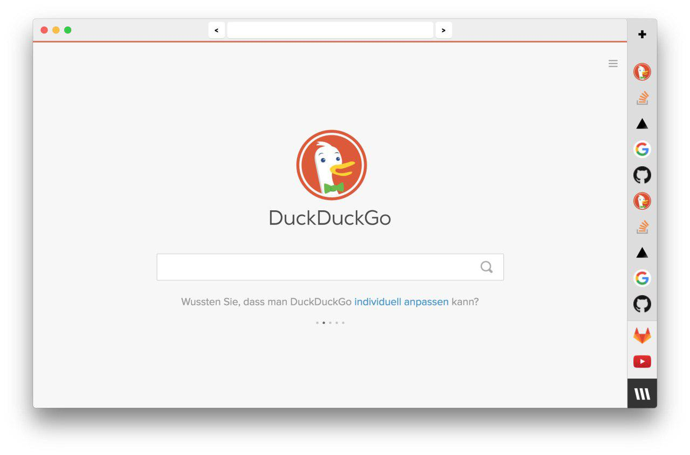

# Browser

## Goal
The main aim of this project is to develop a browser that fits a browsing workflow with many tabs.
The main idea behind it is, that you never have to close a tab again. **Never**.
Both in the UI and the browser backend should be usable without the need to close tabs.

## Design
On the UI side, this should be reached by having a vertical bar of tabs, 
which consists of two parts: 
1. On the one hand, it consists 
of tabs, the user opens from time to time in his daily research. Those tabs are no longer important 
after a few minutes. This group of tabs is called the "tabstream". Tabs who are in the tabstream
can be unloaded by the browser to save resources. At this point of time, a screenshot is taken and
the browser should try to serialize the state of that tab to make it restoreable for later usage.
2. On the other hand, there are the "pinned" tabs. Those tabs mustn't be unloaded by the browser.
Examples for tabs you may want to pin are music player apps, instant messengers or 
issue boards. The pinned tabs are pinned at the bottom of the tab bar and are quickly accessible at any
given point of time.

The forward and backward buttons be able to control the browsing history not just in the current tab.
This is the intuitive behavior, but not the behavior, that is implemented in current browsers.
So when you click backward on a tab, you opened from an other tab, you should get
the tab shown, from whom you opened the tab, you are looking at.

In the default view, every tab is represented by the favicon of the website.
When no favicon is present, some alternative icon should be generated to identify the page.
The problem with representing evey tab with an icon is, that the icons are sometimes not unique enough:
Lets assume you have 5 tabs of `wikipedia.org` open. How could you differentiate between the different articles?
For this case there should be another View: The "OverView" ;). In this view, the tab bar will get 
inflated and the page titles should appear next to the corresponding icons. The current rendered tab
should get smaller and in 
the case of hovering over an tab the browser should show an image of the rendered tab.
If the tab in no longer loaded, a screenshot of it will be shown.
Moreover there should be a search bar with which you can filter your tabs by the title, the url,
the date, etc...

Almost all the things, you need to use a webbrowser in your daily life are not specified here.
Those things should be also implemented, to make it usable, but maybe less complete and less
advanced than in mainstream browsers to save development time and be able to concentrate on the
new and exciting things about this project.

## Technology
The browser will be written in webstack technologies using [electron](http://electron.atom.io/).
The main reason I believe, is that it is easier to write a webbrowser in web technologies than in any other
technology stack. This saves much development time but trades it for a worse performance. That
means, that keeping the performance and resource amount used at an acceptable level is a great challenge.

## Current Status & Contributing
Currently a clickdummy and the beginning of a first version of the browser are excising.
When you want to get information about the current issues and the progress of the project, just have a 
look at this repo and the [issue tracker](https://gitlab.com/nein/browser).

All the thing described in this document are only ideas and can change during the further development.
Feel free do bring in your own ideas and thoughts :). Moreover feel free to fork this project, develop on it,
hack it, and submit pull requests.
